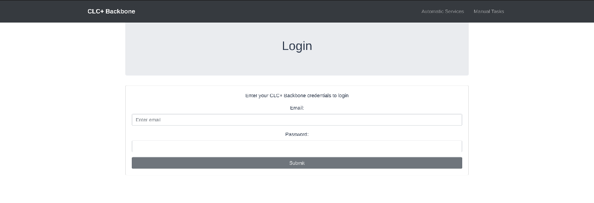
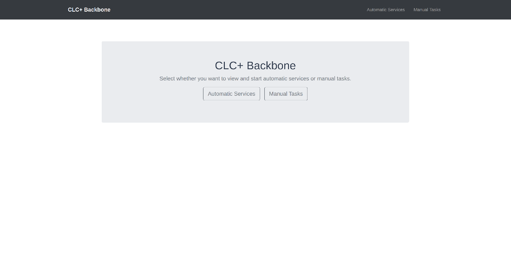
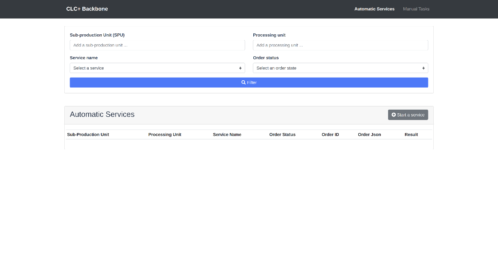
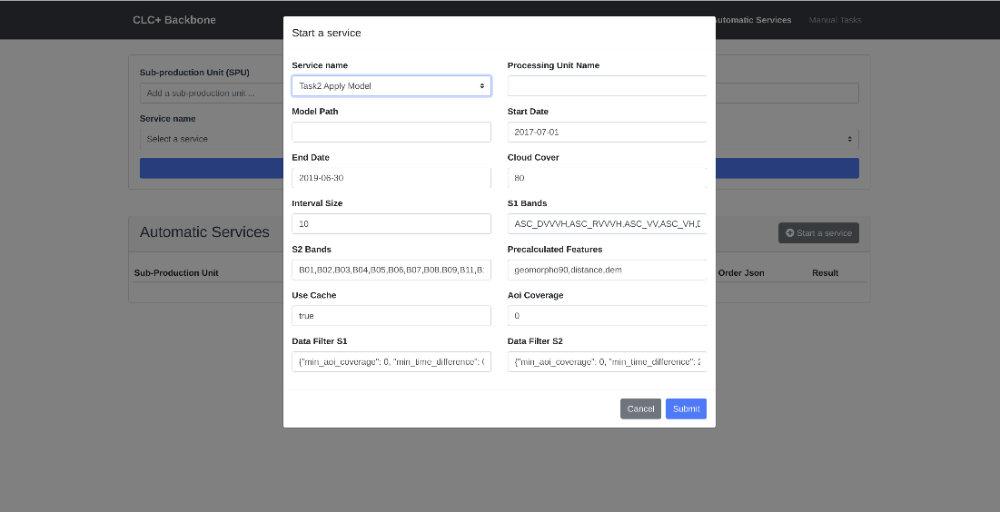
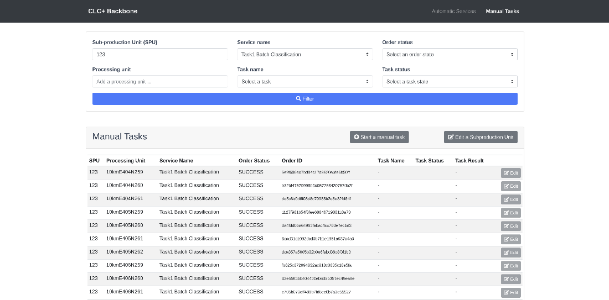

## User Interface

---

## Contributors
* Johannes Schmid
* Patrick Wolf


## General Introduction
This repository contains the code for the CLC+ BB frontend.  
  
The CLC+ BB frontend is a single page application (SPA) which is based on _Vue.JS_ and _Bootstrap_. The frontend app is 
part  of a larger multi-container application. Please visit [this page](https://bitbucket.org/geoville/workspace/projects/CLCPLUS) 
for details.

- Authors: Patrick Wolf, Johannes Schmidt.
- Latest Update: 21.03

## Environment variables
The CLC+ BB app requires one environment variable: 

- API_URL: Defines the endpoint for the asynchronous backend services (see axios)

## Local development
For locally developing the application, the Vue.JS development server can be used. Therefore, the following command can 
be performed:

```
npm run serve
```

This command starts the application on the local host on port 8000.

## Deploy as part of a multi-container application
The CLC+ BB frontend is part of a multi-container application (CLC+ BB multi-container application). In order to run the
frontend as part of  this multi-container application (CLC+ BB frontend and backend), the application must run inside a 
_Nginx_ container. The Nginx server is responsible for delivering the static content of the single page application.

This repository contains a pipeline which creates the image for the single page application and pushes this image to a 
registry. Moreover, the pipeline restarts the entire CLC+ BB multi-container application.  

### Run application in a container
For validating the containerd application locally, a multi-container application can be started. Therefore, please 
perform the commands listed below:

```
- Build: docker-compose -f docker-compose.yaml build
- Run: docker-compose -f docker-compose.yaml up
```

This _docker-compose up_ command starts the application on the local host on port 9001.

## General Description
The productive user interface was developed for the operation of the CLC+ Backbone project. Here, various
automatic processes as well as manual tasks can be started and monitored by GeoVille and GAF.

When entering the user interface at https://ui.clcplusbackbone.geoville.com/, the users are asked to insert
their email address as well as their password (see Figure below).




After a successful log in, the users can choose between “Automatic Services” and “Manual Tasks”.

While automatic services represent processes in Airflow that are started by sending API requests, manual
tasks are non-automatic parts of the operation workflow, for example quality control. Starting a manual task
is nothing more than a status update in the database for monitoring all steps of the operations and not only
the fully automatic steps.



When selecting “Automatic Services”, information such as the processing unit or the service name can be
provided to search for the current operation status - as seen in the following Figure. In case a service was
already successfully processed for a processing unit, it does not need to be processed again.



However, if an automatic service needs to be started, a click on the button “Start a service” will open a pop-
up window (see Figure below). After selecting a service, the relevant parameters such as the processing unit name
can be filled in. A click on the “Submit” button will then send the request to the API gateway and where the
request will be processed if validation succeeds.



The functionality for manual tasks is similar to that for the automatic services. However, besides the
button to “Start a manual task”, there is also a button to “Edit a Subproduction Unit”. With this
button, the user can update the status of a specific task for an entire subproduction unit.



